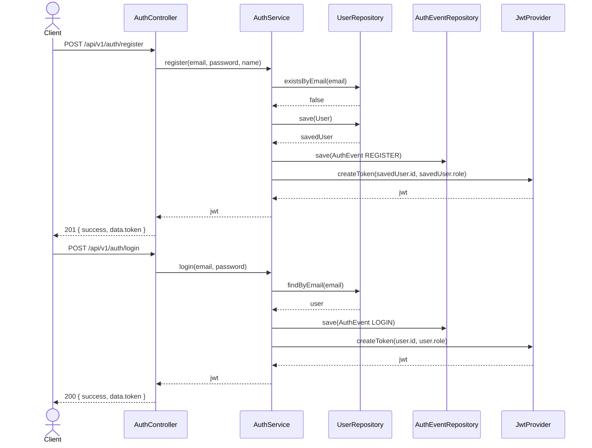
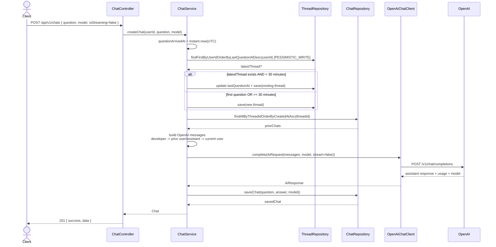
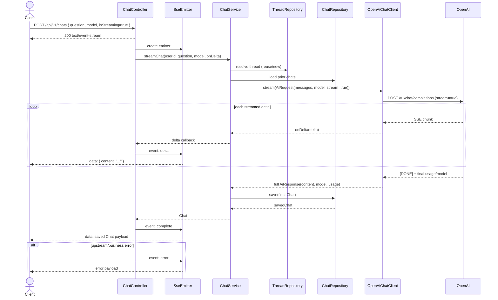
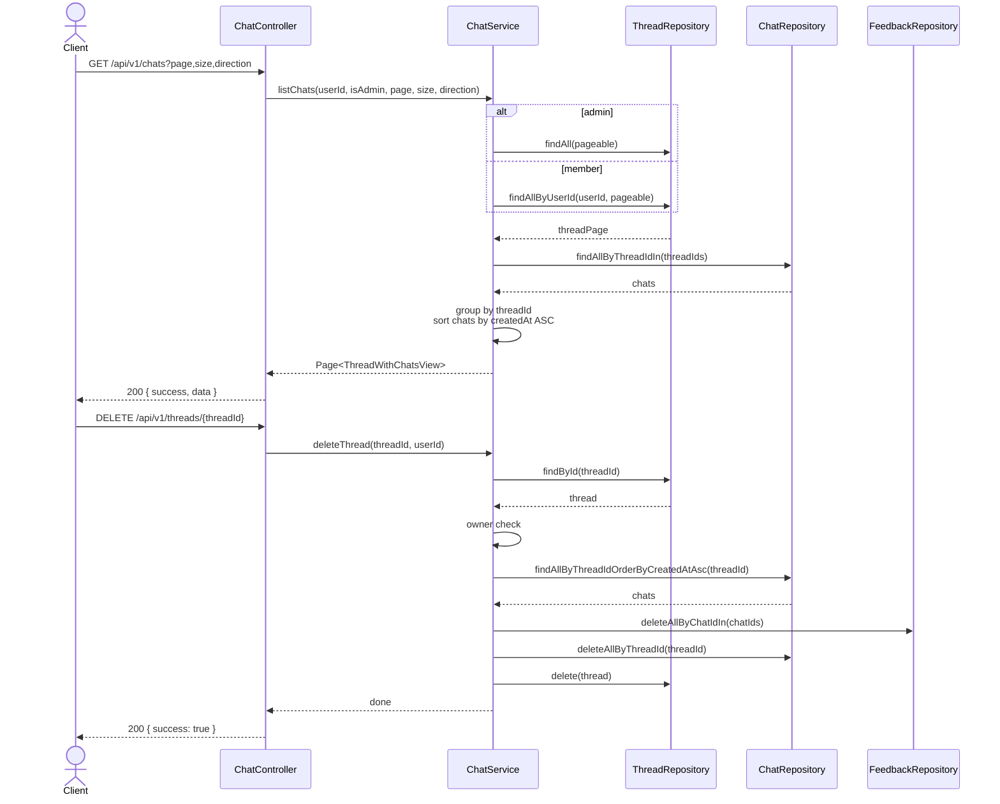
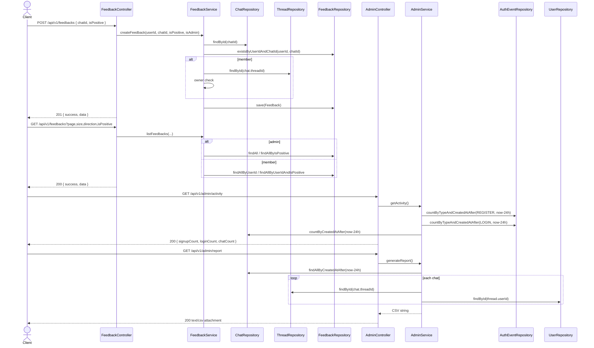

# AI 챗봇 서비스

## Overview
- Kotlin 1.9.25
- Spring Boot 3.5.13
- Java 21
- PostgreSQL 15.8
- Spring Data JPA / JWT / Testcontainers

이 프로젝트는 과제 요구사항 기준으로 아래 기능을 구현한 **AI 챗봇 서비스 API**입니다.
- 회원가입 / 로그인 / JWT 인증
- OpenAI Chat Completions 기반 chat 생성
- 30분 규칙 기반 thread 재사용 / 신규 생성
- thread 단위 chat 목록 조회 + 정렬 + pagination
- `isStreaming=true` 요청 시 SSE(`text/event-stream`) 응답
- feedback 생성 / 목록 조회 / 상태 변경
- admin activity 집계 / CSV report 생성

## Implemented APIs
- `POST /api/v1/auth/register`
- `POST /api/v1/auth/login`
- `POST /api/v1/chats`
- `GET /api/v1/chats`
- `DELETE /api/v1/threads/{threadId}`
- `POST /api/v1/feedbacks`
- `GET /api/v1/feedbacks`
- `PATCH /api/v1/feedbacks/{feedbackId}/status`
- `GET /api/v1/admin/activity`
- `GET /api/v1/admin/report`

## AI Integration
- OpenAI **Chat Completions** endpoint: `/v1/chat/completions`
- 기본 모델: `gpt-5.4`
- 요청별 `model` override 지원
- 대화 문맥은 OpenAI message list 형식으로 조립
  - `developer`
  - 이전 `user`
  - 이전 `assistant`
  - 현재 `user`
- `isStreaming=true`면 SSE 응답을 반환하고, 최종 응답 텍스트를 모두 수집한 뒤 chat을 저장

## Thread / Chat Rules
- 시간 기준은 `Instant` + UTC
- 마지막 질문 시점으로부터 **30분 미만**이면 기존 thread 재사용
- **30분 이상**이면 새 thread 생성
- chat 목록은 **thread 단위 pagination**
- top-level 정렬은 `Thread.createdAt`, thread 내부는 `Chat.createdAt ASC`
- thread 삭제는 hard delete이며 순서는 `feedback -> chat -> thread`

## Sequence Diagrams

### 1) 회원가입 / 로그인 / JWT 발급


### 2) Chat 생성 - 일반 응답


### 3) Chat 생성 - Streaming(SSE)


### 4) Chat 목록 조회 / Thread 삭제


### 5) Feedback / Admin Activity / CSV Report


## Run
### Required environment variables
```bash
export DB_URL=jdbc:postgresql://localhost:5432/sionic
export DB_USERNAME=postgres
export DB_PASSWORD=postgres
export OPENAI_API_KEY=sk-...
export ADMIN_EMAIL=admin@example.com
export ADMIN_PASSWORD=Admin1234!
```

### Optional
```bash
export OPENAI_BASE_URL=https://api.openai.com
export OPENAI_MODEL=gpt-5.4
export JPA_DDL_AUTO=validate
export ADMIN_NAME=Admin
```

### Start
```bash
./gradlew bootRun
```

### Test
```bash
./gradlew test
```

테스트는 PostgreSQL Testcontainers를 사용하고, 외부 AI 호출은 test double로 대체해 business rule과 API 계약을 검증합니다.

## Response Format
### Non-stream success
```json
{ "success": true, "data": { ... } }
```

### Error
```json
{ "code": "C002", "message": "요청한 리소스를 찾을 수 없습니다." }
```

### Stream success
- `Content-Type: text/event-stream`
- `delta` 이벤트로 부분 응답 전송
- `complete` 이벤트로 저장된 최종 chat payload 전송
- 오류 발생 시 `error` 이벤트 전송

## Verification
최신 확인 기준:
- `./gradlew test` ✅
- `./gradlew build` ✅

## Remaining Risks
1. **first-message concurrency**
   - 같은 사용자의 첫 질문이 거의 동시에 들어오면 thread가 둘 이상 생성될 수 있습니다.
   - 기존 thread 재사용 경쟁은 `@Lock(PESSIMISTIC_WRITE)`로 완화했지만, “첫 thread 생성” 자체는 완전 직렬화하지 않았습니다.

2. **AI 실패 시 빈 thread 가능성**
   - 현재는 thread를 먼저 결정/저장한 뒤 OpenAI를 호출합니다.
   - 따라서 외부 AI 호출이 실패하면 chat 없이 thread만 남을 수 있습니다.

3. **SSE 운영성 검증 미흡**
   - SSE 자체는 동작하고 테스트로 검증했지만, 고부하 상황의 backpressure/연결 유지/중간 disconnect 대응은 추가 운영 검증 여지가 있습니다.

4. **model allowlist 미적용**
   - 요청별 모델명은 실제 OpenAI 호출에 반영되지만, 허용 모델 목록 검증은 두지 않았습니다.
   - 잘못된 모델명은 외부 API 오류로 귀결됩니다.
